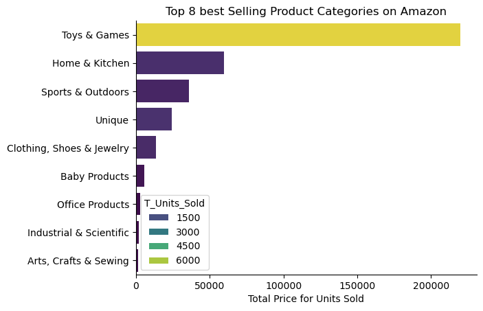
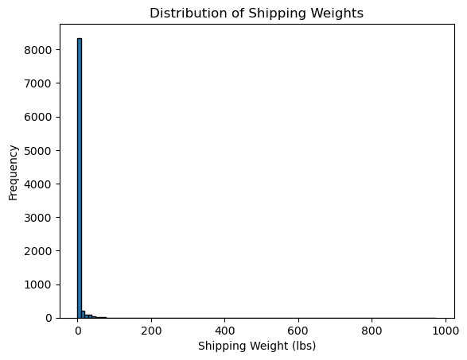
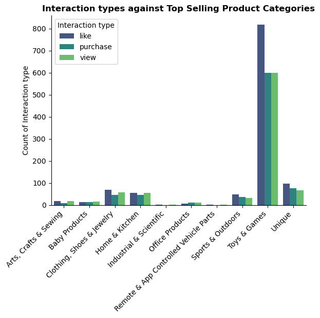
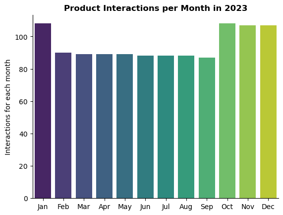
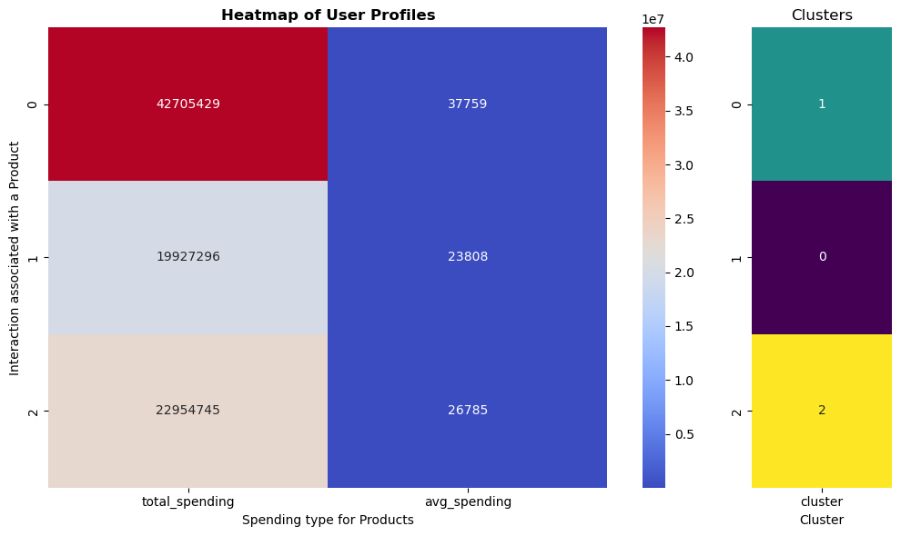
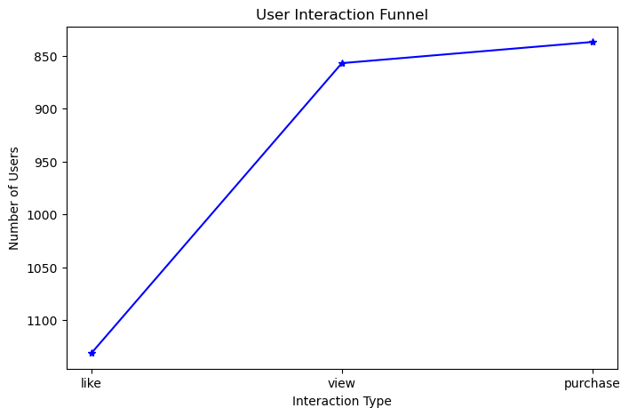
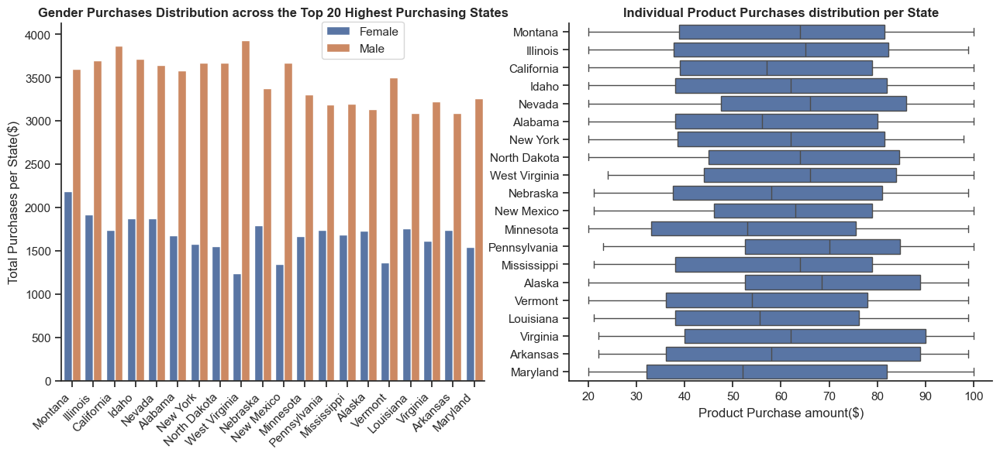
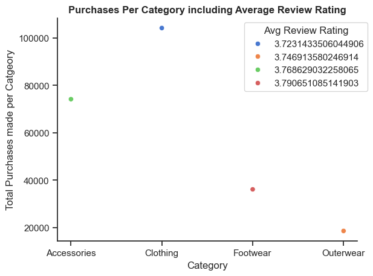
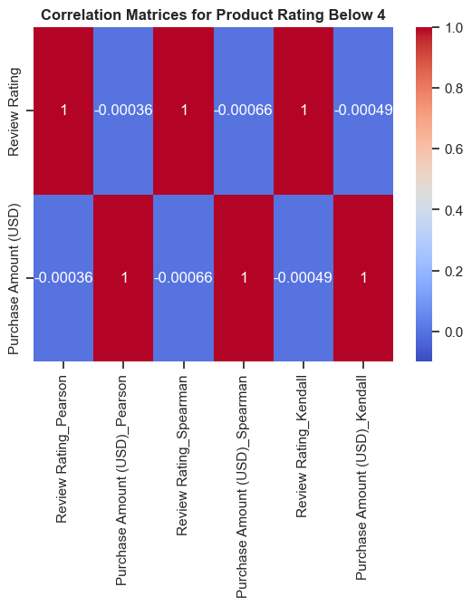
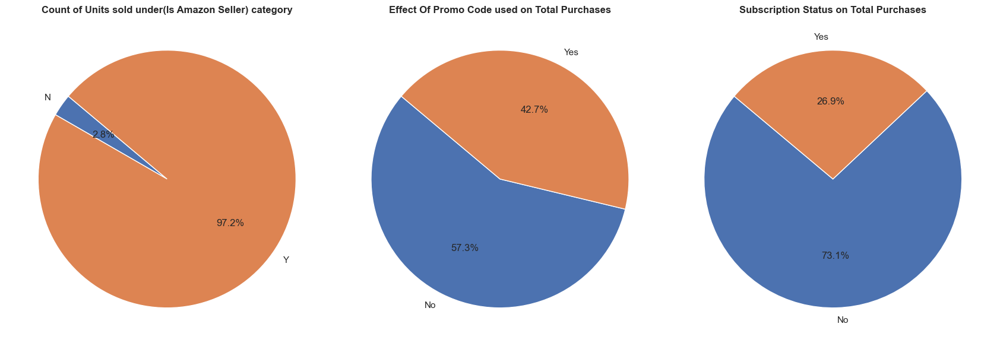

# Introduction
The dataset I used is the Superstore data I gathered from Kaggle that was published by [Ahmed Ali](https://www.kaggle.com/datasets/ahmedaliraja/e-commerece-sales-data-2023-24) over two years ago. It has 3 CSV files containing product details customer details and e-commerce sales data
# Background
I was intrigued by the dataset, which offered valuable insights into the e-commerce performance of a company. It encompasses various metrics, including user interactions and the utilization of subscriptions and promo codes within its operational strategy.
# Tools I used

The tools I used to generate my insights for the project include the following:
- **Python**
- **Visual Studio Code**: My ideal code editor for Python and also SQL.
- **Git and GitHub:** Needed a version control to showcase the steps and changes  made as I progressed with my analysis. It's also ideal for sharing and collaboration purposes.

# Data Cleanup
The initial phase of the project involved extensive data cleaning for all three CSV files, particularly the 'Product Details' file. This process was time-consuming, requiring the use of regular expressions to address inconsistencies in the 'Shipping Weight' column, which included mixed unit measurements. Additionally, I separated the head category from the full category listing in the 'Product Details' file and removed unnecessary columns from the 'E-commerce Sales Data' file to enhance analysis.

### The line of code I used for Data Cleanup
```python
#Data  for df_ecom
df_cust= pd.read_csv(r"C:\Users\Jesse\OneDrive\Desktop\EcommerceAnalysis2024\files\customer_details.csv")
df_cust['Age']=df_cust['Age'].astype(str)
#Data  for df_ecom
df_ecom= pd.read_csv(r"C:\Users\Jesse\OneDrive\Desktop\EcommerceAnalysis2024\files\E-commerece sales data 2024.csv")
delete=df_ecom.columns[4]
df_ecom.drop(labels=delete,axis=1,inplace=True)
df_ecom=df_ecom.dropna(how='all')
# Data Cleanup for df_prod
df_prod= pd.read_csv(r"C:\Users\Jesse\OneDrive\Desktop\EcommerceAnalysis2024\files\product_details.csv")
drop_list=df_prod.columns[[2,3,5,6,8,15,17,18,19,20,21,22,23,24,26,27]].to_list()
df_prod.drop(labels=drop_list,axis=1,inplace=True)
df_prod['Selling Price']=df_prod['Selling Price'].replace('[\$,]','',regex=True)
df_prod=df_prod.rename(columns={'Uniqe Id':'Unique Id'})
df_prod['Selling Price']=pd.to_numeric(df_prod['Selling Price'],errors='coerce')
df_prod['Selling Price']=df_prod['Selling Price'].fillna(0).astype(int)
def convert_to_pounds(weight_str):
    # Check if the input is a string
    if isinstance(weight_str, str):
        # Regular expression to match the numeric part and the unit
        match = re.match(r'([\d.]+)\s*(pounds|ounces)', weight_str.strip())
        if match:
            try:
                value = float(match.group(1))
                unit = match.group(2)
                if unit == 'ounces':
                    # Convert ounces to pounds
                    return value * 0.0625
                else:
                    # Already in pounds
                    return value
            except ValueError:
                # Handle conversion errors
                return None
    # Return None for non-string values or invalid formats
    return None
df_prod['Shipping Weight (lbs)']=df_prod['Shipping Weight'].apply(convert_to_pounds)
df_prod.drop(labels='Shipping Weight',axis=1,inplace=True)
df_prod['Category']=df_prod['Category'].fillna('')
df_prod['CategorySplit']=df_prod['Category'].str.split('|')
df_prod['HeadCategory']=df_prod['CategorySplit'].apply(lambda x:x[0] if isinstance(x, list) and len(x) > 0 else None)
df_prod['HeadCategory']=df_prod['HeadCategory'].str.strip()
df_prod['SubCategory']=df_prod['CategorySplit'].apply(lambda x: '|'.join(x[1:]) if isinstance(x, list) and len(x) > 1 else None)
df_prod.drop(columns=['CategorySplit'], inplace=True)
```

# The Analysis
## 1.  Product Performance focus
### 1.1. How do different product categories compare in terms of sales revenue and units sold? 

During the initial filtering process, I noticed that some values lacked category listings, preventing proper grouping. To address this, I utilized the 'Product Details' section to recategorize these products based on specific keywords extracted from their descriptions. These keywords were matched against the names in the 'Head Category' section of the dataframe. For products that couldn't be categorized, I assigned a label called 'Unique'.

View my notebook showcasing the steps I took:
[Product_Performance](ProductPerformance.ipynb)

## This is the code snippet I used to create my visualization:
```python
CategorySales=df_prod.groupby('HeadCategory').agg(T_Selling_Price=('Selling Price','sum'),T_Units_Sold=('Unique Id','size')).sort_values(by='T_Selling_Price',ascending=False).head(9)
sns.barplot(data=CategorySales,y='HeadCategory',x='T_Selling_Price',hue='T_Units_Sold',palette='viridis')
sns.despine()
plt.title('Top 8 best Selling Product Categories on Amazon',loc='center')
plt.ylabel('')
plt.xlabel('Total Price for Units Sold')
```

### Result


*Bar graph visualizing the Top 8 Selling Product Categories.*

### Insights
- The highest Selling product Ctageory by a big margin is 'Toys and Games' with over 200,000 dollars worth of units sold.

### 1.2.  Analyze how shipping weight impacts the selling price.

View my notebook showcasing the steps I took:
[Product_Performance](ProductPerformance.ipynb)

## This is the code snippet I used to create my visualization:

```python
weight_distr=df_prod.groupby('Shipping Weight (lbs)').agg(T_Selling_Price=('Selling Price','sum'),M_Selling_Price=('Selling Price','mean'),Count=('Shipping Weight (lbs)','count')).sort_values(by='Count',ascending=False)
weight_distr=weight_distr[weight_distr['Count']>10].reset_index()
weight_distr.sort_values(by='M_Selling_Price',ascending=False)

plt.figure(figsize=(10,6))
sns.regplot(y='M_Selling_Price',x='Shipping Weight (lbs)',data=weight_distr)
plt.title('Shipping Weight vs Mean Selling Price',fontweight='bold')
plt.xlabel('Shipping Weight (lbs)')
plt.ylabel('Mean Selling Price')
plt.show()
```

### Result

*Regression plot visualizing how Shipping weight affects the Average selling price of a product.*

### Insights
- The analysis reveals that a significant number of products fall within the 0-2 pound weight range. However, as the weight increases, there's a notable rise in outliers, suggesting a correlation between product weight and selling price. This indicates that the e-commerce store could potentially benefit from expanding its product offerings to include heavier items, provided shipping costs remain reasonable. A histogram further confirms the concentration of products in the 0-2 pound category.


## 2. E-commerce Sales  
### 2.1 What are the most common types of interactions and how do they vary by product category? 

View my notebook showcasing the steps I took:
[E_commerce Sales](E_commerceSales.ipynb)

## This is the code snippet I used to create my visualization:

```python
sns.barplot(data=df_plot,x='HeadCategory',y='Interaction count',hue='Interaction type',palette='viridis')
sns.despine()
plt.xticks(rotation=45,ha='right')
plt.ylabel('Count of Interaction type')
plt.xlabel('')
plt.title('Interaction types against Top Selling Product Categories',fontweight='bold')

plt.show()
```

### Result

*Bar graph visualizing the interaction types amongst the Top 10 selling Product Categories of the E-commerce store.*

### Insights
- The highest selling category has the most user interactions by a large margin but product categories like 'Home and Kitchen','Clothing,Shoes&Jewerelly' and 'Unique' also have close to 100 interactions.

### 2.2  Analyze the time patterns of user interactions.

View my notebook showcasing the steps I took:
[E_commerce Sales](E_commerceSales.ipynb)

## This is the code snippet I used to create my visualization:

```python
df_ecom['Time stamp'] = pd.to_datetime(df_ecom['Time stamp'], errors='coerce')
df_ecom.set_index('Time stamp',inplace=True)
monthTrends=df_ecom.resample('ME').size().to_frame(name='Interactions per month').reset_index()
monthTrends['Month']=monthTrends['Time stamp'].dt.strftime('%b')
sns.barplot(data=monthTrends,x='Month',y='Interactions per month',hue='Month',palette='viridis')
sns.despine()
plt.title('Product Interactions per Month in 2023',loc='center',fontweight='bold')
plt.ylabel('Interactions for each month')
plt.xlabel('')
plt.show()
```

### Result


*Bar graph visualizing the monthly user interactions data.*

### Insights
- The majority of customer interactions with the e-commerce website occur between October and January, likely due to the holiday season and the back-to-school shopping period in January.


### 2.3  Analyzing the relationship between Spending and user interactions.
Decided to generated a K-means cluster to help in showcasing the correlation between users who interact with products at different againt their overall spend and avergae spend.

View my notebook showcasing the steps I took:
[E_commerce Sales](E_commerceSales.ipynb)

## This is the code snippet I used to create my visualization:

```python
user_profiles_numeric = user_profiles.drop(columns=['Interaction type'])


# Normalize data
scaler = StandardScaler()
X_scaled = scaler.fit_transform(user_profiles[['total_spending', 'avg_spending']])

# Apply K-Means Clustering
kmeans = KMeans(n_clusters=3, random_state=0).fit(X_scaled)

# Add cluster labels back to the user_profiles DataFrame
user_profiles['cluster'] = kmeans.labels_

fig, (ax1, ax2) = plt.subplots(1, 2, figsize=(10, 6), gridspec_kw={'width_ratios': [5, 1]})

# Heatmap for total_spending and avg_spending
sns.heatmap(user_profiles[['total_spending', 'avg_spending']], annot=True, cmap='coolwarm', fmt='.0f', ax=ax1)
ax1.set_title('Heatmap of User Profiles', fontweight='bold')
ax1.set_ylabel('Interaction associated with a Product')
ax1.set_xlabel('Spending type for Products')

#color-coded side panel for the clusters
sns.heatmap(user_profiles[['cluster']], annot=True, cmap='viridis', cbar=False, ax=ax2)
ax2.set_title('Clusters')
ax2.set_ylabel('')
ax2.set_xlabel('Cluster')


plt.tight_layout()
plt.show()

```
### Result

*Heatmap of User interactions against spending using K-means clustering*

### Insights
- The heatmap demonstrates that users who interacted by liking products made significant contributions to total spending. This underscores the importance of a robust digital marketing strategy at the awareness stage of the marketing funnel to encourage more likes and, consequently, drive increased purchases

### 2.4 Wha would a user Interaction funnel look like for the store?

View my notebook showcasing the steps I took:
[E_commerce Sales](E_commerceSales.ipynb)

## This is the code snippet I used to create my visualization:
```python
df_sorted = ecom_prod.sort_values(['user id', 'Time stamp'])

interaction_order = ['like', 'view', 'purchase']
# Count the number of each interaction type leading to a purchase
funnel = df_sorted.groupby('Interaction type')['user id'].nunique().reindex(interaction_order).reset_index()
funnel.columns = ['Interaction Type', 'Number of Users']
funnel

# Create a funnel plot
plt.figure(figsize=(8, 5))
plt.plot(funnel['Interaction Type'], funnel['Number of Users'], marker='*', linestyle='-', color='blue')
plt.title('User Interaction Funnel')
plt.xlabel('Interaction Type')
plt.ylabel('Number of Users')
plt.gca().invert_yaxis()  # To make it look like a funnel
plt.show()
```

### Result


*Line plot showing the path from like to purchase for customers*

### Insights
- Over 1150 users like the products and as it reaches the purchase phase, about 850 purchase the products which shows that the strategy for having more likes is generating more purchases.

## 3. Customer Analysis
### 3.1 How does Location influence purchase amount and What is the distribution of purchase amounts across different age groups?

View my notebook showcasing the steps I took:
[CustomerAnalysis](CustomerAnalysis.ipynb)

## This is the code snippet I used to create my visualization:

```python
fig,ax=plt.subplots(1,2,figsize=(15.5,6))
sns.barplot(data=Top20Purchases_bar,x='Location',y='Purchase Amount (USD)',order=LocationTop20,ax=ax[0],hue= 'Gender')
sns.despine()
ax[0].set_xticklabels(ax[0].get_xticklabels(), rotation=45, ha='right')
ax[0].set_title('Gender Purchases Distribution across the Top 20 Highest Purchasing States',fontweight='bold')
ax[0].legend(loc='best',bbox_to_anchor=(0.6,1.02))
ax[0].set_xlabel('')
ax[0].set_ylabel('Total Purchases per State($)')


# The States start from the highest purchasing to lowest from the top of the y-axis
LocationTop20=TopLocationSales['Location'].to_list()
sns.boxplot(data=df_cust,y='Location',x='Purchase Amount (USD)',ax=ax[1],order=LocationTop20)
sns.set_theme(style='ticks')
sns.despine()
ax[1].set_title('Individual Product Purchases distribution per State', fontweight='bold')
ax[1].set_xlabel('Product Purchase amount($)')
ax[1].set_ylabel('')

plt.show()
```

### Result


*Mixed bar graph and boxplot showcasing the distribution of total purchases per state agains Gender and individual price distribution per state. Note: The States start from the highest purchasing to lowest from the top of the y-axis and left to right on the x-axis.*

### Insights
- Montana is the top-spending state, partly due to having the highest number of female purchasers compared to other states, despite males being the primary purchasers overall. While states like West Virginia and New Mexico have a more balanced gender distribution, Montana's female customer base is significantly larger, exceeding 2,000.
- There is significant variation in interquartile data across states. Montana has a median purchase price between $65 and $70, and 75% of purchases exceed $80.

### 3.2  What are the most purchased product categories?

View my notebook showcasing the steps I took:
[CustomerAnalysis](CustomerAnalysis.ipynb)

### Result

*Scatterplot showcasing the most purchased product Categories*

### Insights
- The most sought after product category is clothing and all the four products seem to have the same average review rating from users.

### 3.3 How do different review ratings correlate with purchase amounts? 
To analyze the relationship between customer reviews and purchases, I employed all three correlation coefficient matrices to determine if consistent findings emerged across different methods.

View my notebook showcasing the steps I took:
[CustomerAnalysis](CustomerAnalysis.ipynb)

## This is the code snippet I used to create my visualization:

```python
Above4Review=df_cust[df_cust['Review Rating']>4]
pearson_df=Above4Review[['Review Rating','Purchase Amount (USD)']].corr(method='pearson')
spearman_df=Above4Review[['Review Rating','Purchase Amount (USD)']].corr(method='spearman')
kendall_df=Above4Review[['Review Rating','Purchase Amount (USD)']].corr(method='kendall')
combined_matrx_A= pd.concat([
    pearson_df.add_suffix('_Pearson'),
    spearman_df.add_suffix('_Spearman'),
    kendall_df.add_suffix('_Kendall')
], axis=1)

combined_matrx_A

sns.heatmap(combined_matrx_A, annot=True, cmap='coolwarm', vmin=-0.1, vmax=1)
plt.title('Correlation Matrices for Product Rating Above 4',fontweight='bold')
plt.show()
```

### Result


*HeatMap showcasing the relationship between review rating above 4 and purchases*

*HeatMap showcasing the relationship between review rating below 4 and purchases*

### Insights
- While the correlation between review ratings and purchases was relatively weak, a positive correlation was observed for ratings above four, and a slightly negative correlation for ratings below four. This suggests that the company's focus on providing a positive user experience within its e-commerce store may contribute to increased product purchases.

### 3.4 Assess the impact of promo codes, subscription status, and whether or not an 'Amazon seller' affects purchase amounts.

View my notebook showcasing the steps I took:
[CustomerAnalysis](CustomerAnalysis.ipynb)

## This is the code snippet I used to create my visualization:

```python
fig,ax=plt.subplots(1,3,figsize=(17,6))

AmazonSeller=df_prod.groupby('Is Amazon Seller')['Selling Price'].agg(['mean','size']).reset_index()
sizes1=AmazonSeller['size']
labels1=AmazonSeller['Is Amazon Seller']

ax[0].pie(sizes1,labels=labels1,autopct='%1.1f%%',startangle=140)
ax[0].set_title('Count of Units sold under(Is Amazon Seller) category',fontweight='bold')

promo_code_used=df_cust.groupby('Promo Code Used')[['Purchase Amount (USD)']].agg(T_Purchase=('Purchase Amount (USD)','sum')).reset_index()
sizes2 = promo_code_used['T_Purchase']
labels2 = promo_code_used['Promo Code Used']
ax[1].pie(sizes2,labels=labels2,autopct='%1.1f%%',startangle=140)
ax[1].set_title('Effect Of Promo Code used on Total Purchases',fontweight='bold')

subscription_status=df_cust.groupby('Subscription Status')[['Purchase Amount (USD)']].agg(
    T_Purchase=('Purchase Amount (USD)','sum')).reset_index()
sizes3 = subscription_status['T_Purchase']
labels3 = subscription_status['Subscription Status']
ax[2].pie(sizes3,labels=labels3,autopct='%1.1f%%',startangle=140)
ax[2].set_title('Subscription Status on Total Purchases',fontweight='bold')

plt.tight_layout()
plt.show()

```

### Result

*Pie Charts showcasing Purchase amounts relationship with different parameters*

### Insights
- Having a subsription status or a customer using a promo code didnt necessarily mean having higher purchases. However, being an 'Amamzon seller' significantly impacted purchases for the e-commerce store.

# Challenges
The most significant challenge encountered during the project was data cleaning for the 'Product Details' CSV file. Specifically, the 'Shipping Weight' column contained mixed weight units (pounds and ounces), which presented a complex issue. To address this, I utilized ChatGPT to find a solution for standardizing the weight units while preserving the individual weight values, which were encoded as a combination of numeric and string components (e.g., '10.7 pounds').

The code I used to fix this problem:
```python
def convert_to_pounds(weight_str):
    # Check if the input is a string
    if isinstance(weight_str, str):
        # Regular expression to match the numeric part and the unit
        match = re.match(r'([\d.]+)\s*(pounds|ounces)', weight_str.strip())
        if match:
            try:
                value = float(match.group(1))
                unit = match.group(2)
                if unit == 'ounces':
                    # Convert ounces to pounds
                    return value * 0.0625
                else:
                    # Already in pounds
                    return value
            except ValueError:
                # Handle conversion errors
                return None
    # Return None for non-string values or invalid formats
    return None
df_prod['Shipping Weight (lbs)']=df_prod['Shipping Weight'].apply(convert_to_pounds)
df_prod.drop(labels='Shipping Weight',axis=1,inplace=True)
```

# Conclusions
The dataset was very interesting to evaluate. It showed an overall view of how an e-commerce store performs. The main takeaways I gathered from the data include:
- The store needs to start accounting for items that have higher weights than the mean to increase overall sales.
- The store needs to focus on generating more female users across different regions to better improve its sales.
- The Toys and Games category significantly dominates the store's sales compared to other categories. To mitigate overreliance on a single product category, a much stronger product diversification is necessary.

# What I learned
I was able to improve upon my python skills, analyze data and gain curcial insights into how an e-commerce store operates and the main metrics to look out for. I learnt a lot of new code and a different way of approaching challenges in python especially when it comes to using regular expressions for future cases of Data Cleanup.